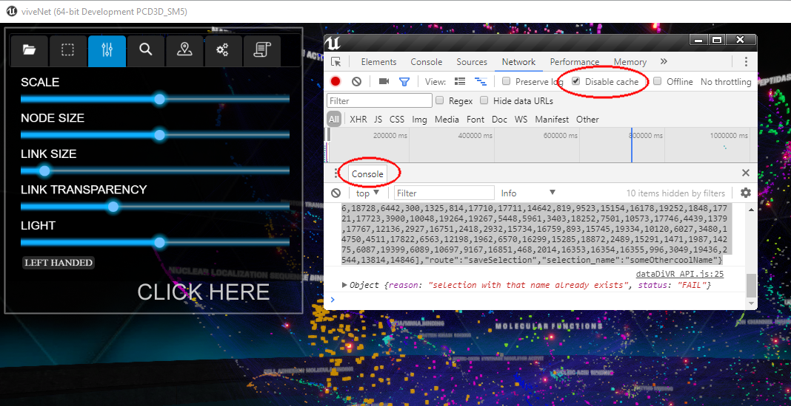

## **VRNetzer - A Virtual Reality Framework for Network Visualization and Analytics**


Networks provide a powerful representation of complex systems of interacting components. In addition to a wide range of available analytical and computational tools, networks also offer a visual interface for exploring large data in a uniquely intuitive fashion. <br>However, the size and complexity of many networks render static visualizations on common screen or paper sizes impractical and result in proverbial 'hairballs'. Here, we introduce an immersive Virtual Reality (VR) platform that overcomes these limitations and unlocks the full potential of visual, interactive exploration of large networks. <br>Our platform is designed towards maximal customization and extendability, with key features including import of custom code for data analysis, easy integration of external databases, and design of arbitrary user interface elements. As a proof of concept, we show how our platform can be used to interactively explore genome-scale molecular networks for identifying genetic aberrations responsible for rare diseases and develop hypotheses on their respective pathobiological mechanisms. <br>Our platform represents a first-of-its-kind, general purpose VR data exploration platform in which human intuition can work seamlessly together with state-of-the-art analysis methods for large and diverse data. 
<br>
<br>
**Note:** This project is still in an infant state of development. This is a public beta release, meaning it is not fit to be used in any critical applications yet and may still contain some bugs.
You can [get in touch](mailto:vrnetzer@menchelab.com) with us if you would like to contribute to the further development of this project.
<br>
<br>

## **Content**

[**Hardware Requirements**](#Hardware-Requirements)

[**Installation: Quick Start**](#Installation-Quick-Start)

[**Installation: Stand Alone**](#Installation-Stand-Alone)

[**Desktop Mode**](#Desktop-Mode) 

[**Data Logging**](#Data-Logging)

[**Take screenshots and record videos**](#Take-screenshots-and-record-videos)

[**VRNetzer Architecture Overview**](#VRNetzer-Architecture-Overview)

[**Tutorial 1: Using the Uploader to add your own network**](#Tutorial-1-Using-the-Uploader-to-add-your-own-network)

[**Tutorial 2: Creating custom User Interfaces**](#Tutorial-2-Creating-custom-User-Interfaces)

[**Tutorial 3: Creating a route on the backend**](#Tutorial-3-Creating-a-route-on-the-backend)

[**USE CASE Gene prioritization**](#USE-CASE-Gene-prioritization)

[**VRnet API Documentation**](#VRnet-API-Documentation)

[**Dependencies**](#Dependencies)

[**License**](#License)


## **Hardware Requirements**

 We are running the platform on an MSI gaming laptop with the following specs:
 - CPU: i7 - 7820HK
 - RAM: 16 GB
 - GPU: NVIDIA 1070 TI
 - OS: WINDOWS 10

 and a VR HEADSET - we tested the following:
 - HTC VIVE VR Headset + controllers
 - OCULUS QUEST + controllers

## **Installation: Quick Start** 
Time required ~ 10min

For a quick start, you can just [download the VR Module executable](https://menchelab.com/VRNetzer/VR_Module.zip) and run VR_Module.exe on your windows computer with a [SteamVR compatible headset](https://store.steampowered.com/app/250820/SteamVR/?l=english). Please watch this [video](https://youtu.be/W5tW_tb3LGk) that will help to get you started.
The VR Module comes preconfigured to connect to the other modules that we already installed on our server to make it easy for you to get a first impression. 
It has the ability to upload your own datasets, but we don't recommend it. **Do NOT upload any sensitive data here**, this is **only for demonstration purposes** and for the whole world to see. We don't guarantee your data's safety! If you want to work with your own data you should use the [Stand Alone](#Installation-Stand-Alone) version.

## **Installation: Stand Alone** 
Time required ~ 60min

However, if you want to implement your own datasets and functionalities, you can also **run everything localy on your machine (the SAFE option if you are dealing with sensitive data)** or run the Analytics Module and UI Module on a networkserver or cloud service (if you need scalability and processing power).<br>Here is a step by step guide how to do a local installation on a windows computer. Note that the Analytics Module and the UI Module can also run on a (linux) server,
while the VR Module needs to run on a windows 10 machine as gaming hardware is required for Virtual Reality which is best supported under windows.

### **1.) Set up a MySql Database**

- download and install [MySql Workbench](https://dev.mysql.com/downloads/workbench/)
- download the .dump file of our database [from here](https://ucloud.univie.ac.at/index.php/s/mvO5h6AfFyin0Gi)
- Create a new database, user and password and upload .sql file to it

you have now a clone of our database on your local machine.

### **2.) Clone the [Analytics Module repository](https://github.com/menchelab/Analytics_Module)** into a new folder somewhere on your computer called "VRNetzer"

- install [python >3.6,](https://www.python.org/downloads/) make sure its added to path variable
- install [pip](https://pypi.org/project/pip/) for python

- edit VRNetzer/Analytics_Module/db_config.py to match the database host and user you created before and save


- right click on VRNetzer/Analytics_Module/runAnalytics_Module.ps1 -> "run with power shell" <br>

- if the output of the console window that just opened ends with "Running on http://127.0.0.1:1337/"
you are good to go, if there are errors you will need to install dependencies.

### **3.) Clone the [UI Module repository](https://github.com/menchelab/UI_Module/)** into "VRNetzer"

- install [python >3.6,](https://www.python.org/downloads/) make sure its added to path variable
- install [pip](https://pypi.org/project/pip/) for python
- edit VRNetzer/uiserver/static/js/UI_Module_Config.js and set "dbprefix" to the address of your dataServer , here: 'http://127.0.0.1:1337' and save.
- edit VRNetzer/UI_Module/static/js/ UI_Module_Config.js and set "dbprefix" to the address of your Analytics Module, here: 'http://127.0.0.1:1337' and save.


- right click on VRNetzer/UI_Module/run_UI_Module.ps1 -> "run with power shell"

- if the output of the console window that just opened ends with "Running on http://127.0.0.1:5000/"
you are good to go, if there are errors you will need to install dependencies.
    
### **4.) Download the [VR Module executable](https://menchelab.com/VRNetzer/VR_Module.zip)** and extract it to "VRNetzer"
- if you haven't already, make a Steam account and install [SteamVR](https://store.steampowered.com/app/250820/SteamVR/) and test your headset
- edit VRNetzer/VRnet/viveNet/Content/data/Config.txt and change the address to the one where your UI Module is, here http://127.0.0.1:5000/ 
- run VR_Module.exe

## **Desktop Mode**

It is possible to run the VR Module in desktop mode which is useful for development tasks but does not provide the full functionality as with a headset.<br>To do so, change the value `"vr":true` in the config file of the VR Module to `"vr":false` and restart the VR Module.

## **Data Logging**
The VR Module can produce log files that contain a list of all that has happened during a VR session. This produces quite big textfiles and is therefore turned off by default. <br>To enable logging change the value `"logging":false` in the config file of the VR Module to `"logging":true` and restart the VR Module. The log files are generated in `VRNetzer/VR_Module/viveNet/Content/data`.

## **Take screenshots and record videos**

If you want you can take screenshots and videos of the running application using nvidia geforce experience, which is a free download for nvidia graphics cards, find it here: [geforce experience](https://www.nvidia.com/de-at/geforce/geforce-experience/).
After installation the default key combination for taking a screenshot is alt+f1 and to start or stop a video recording you press alt+f9. Depending on your setup you might need to enable the ingame overlay and enable desktop recording in the privacy settings in the geforce experience settings if the hotkeys do not work right away.

## **VRNetzer Architecture Overview**

The **VRNetzer** platform consists of 5 Modules:<br>

### **VRNet** - the virtual reality module written in Unreal Engine

Unreal Engine is one of the industry leaders in the videogame world. We chose it as the base for our VR Module for it's astounding graphics performance, continuous support of upcoming VR hardware and because it's open source.

### [**UI Module** - a jQuery and html website ](https://github.com/menchelab/UI_Module)

**The UI Module** is running in the browser of your local machine and can **SEND GET and POST requests TO the Analytics Module.** 
Nearly all actions originate here (exept the ones in the VR Module, like if the user touches a node or moves the network with the VR controllers).
<br>**Think of the UI Module as the frontend of a website and the Analytics Module as it's backend.**
<br>A User clicks on a button on the frontend, this makes it to send a post request to a specific URL (route) on the backend (the Analytics Module), await it's response and finally display the result as text or as a graph on the user interface and/or call functions in the VR Module to alter the appearence of the network displayed in VR. <br>The Analytics Module can only RESPOND to those requests, meaning the Analytics Module can never send something to the frontend without being asked. Every communication is Initiated by the UI Module.

Now here is what's special about the UI Module:

 - It can also **SEND api function calls to the VR Module**
 
 <br>**AND**<br>

 - It can **RECEIVE calls from the VR Module** 

In contrast to the Analytics Module, the VR Module CAN initiate communication with the UI Module and call special functions set up in the UI Module.
This picture illustrates the different routes of communication in the framework. 


### [**Analytics Module** - a Flask/Python webserver](https://github.com/menchelab/UI_Module)

The Analytics Module is the backend that performs all the data science tasks. It has 
- **separate routes (URLs) defined for each task** <br> When the UI Module sends a request to one of these, it parses the input parameters, makes database queries and performs calculations, and finally returns it's response to the UI Module.
- **it can run on the local machine or on a powerful cloud server** if more power is needed

### **SQL database**

All data is stored within a MySQL database.  The following schema shows the minimal set of tables that describes one single network. 

The schema and the related tables are auto-generated and auto-populated upon user upload.  To upload your own network, see [Tutorial 1](https://github.com/menchelab/VRNetzer/blob/main/README.md#Tutorial-1-Using-the-Uploader-to-add-your-own-network).

For advanced users: 

Additionally, you may want to include more data to contextualize your nodes or edges.  For example, in our proof of concept application, we use additional tables to store:
- hierarchical information of our taxonomic node annotations (attribute_taxonomies)
- articles mentioning specific genes (articles, nodes_articles)
- gene expression levels of genes in different tissues (gtex_values)

The possibilities are endless!  Functions to query or manipulate the database are in [tables.py](https://github.com/menchelab/Analytics_Module/blob/master/tables.py) of the Analytics Module.


## **Tutorial 1: Using the Uploader to add your own network**


WINDOWS
- right click on VRNetzer/ Analytics_Module/runAnalyticsModule.ps1 -> "run with power shell" to start the Analytics Module
- right click on VRNetzer/ UI_Module/run_UI_Module.ps1 -> "run with power shell" to start the UI Module
- open the web frontend of the UI Module in a browser /http://127.0.0.1:5000/upload 

MAC/LINUX
- open terminal, cd to Analytics_Module and run app.py with python3
- open terminal, cd to UI_Module and run json_io.py with python3
#
- open the web frontend of the UI Module in a browser http://127.0.0.1:5000/upload <br> 

<!---
- tick "Create Project" and choose a name that isn't already in the dropdown menu
-->

- select .csv files to upload, [they must be formatted after these guidelines](#Csv-file-formats)  At minimum, you must have a file to describe the nodes and their positions.  If you have a node list, you can also upload af ile to describe the attributes of the nodes.
- restart the VR Module and load your project 


## **Tutorial 2: Creating custom User Interfaces**

The User Interface in the virtual reality module is a website made with jQuery. In this tutorial you will learn how to make UI elements like buttons or dropdown lists and how to communicate with the VR and Analytics Module. <br>Basic JavaScript and HTML skills required.
<br>Prerequisites: install the VRNetzer framework on your local machine [**Installation: Stand Alone**](#Installation-Stand-Alone) 

### **Step 1: Create a button**

- in [Visual Studio Code](https://code.visualstudio.com/) (or the text editor of your choice) File -> Open Folder -> navigate to your UI Module Folder

- right click on VRNetzer/Analytics_Module/runAnalyticsModule.ps1 -> "run with power shell" <br> 

- right click on VRNetzer/UI_Module/runUIModule.ps1 -> "run with power shell" 

- open the VR Module's config.txt file located at `VRNetzer/VR_Module/viveNet/Content/data` in your text editor and change `"vr":true` to `"vr":false` and `"UIServerAdress":"....."` to  `"UIServerAdress":"http://127.0.0.1:5000/"` or where your UI Module is running and save the file
- run VR_Modul.exe
- it might promt you to install DirectXRuntime, follow the instructions

- Once the VR Module opens, you will see the main UI to which we will add something in the right-most tab in the left upper corner of the 3D view.
- press Alt + Enter to switch from fullscreen to windowed mode.

- click on the user interface in the left corner and hit 'Ctrl + Shift + i' to open the developer tools, click on "Network" and tick the "Disable Cache" checkbox. Note the "Console" window, where debugging output is displayed. <br> 
- open `VRNetzer/UI_Module/templates/main.html` in your editor
- at the end of the file, after` <div id="tabs-7">` add `<button id="MyNewButton"> EXIT </button>`
- save changes to main.html and refresh the browser by clicking in the red area and hit F5 <br>
- if you now navigate to the right most tab again, the button appeared. It looks grey though, not like the other buttons. 

The different elements of the page are set up in the html documents. All the logic happens in the JavaScript, in the `UI_Module\static\js` folder.

**VRNetzer_API.js** is the most important, it has **all the functions to communicate between the Analytics Module and the VR Module.**

Then there is **a file for each of the html files** (main_UI.js). These all have this initialization function `$(document).ready(function () {....}` and in there are functions **that bind to the UI elements created in Html**. For our button we do this:

- at the end of main_UI.js, but still inside the document.ready() function put this code:<br> 
```
$(function () {
        $("#MyNewButton").button();
        $("#MyNewButton").click(function (event) {
            event.preventDefault();
            logger("click!") 
        });
    });
```
- save and refresh the browser <br> 

Now that jQuery is aware of the new button the css styling also works. Click it and the console outputs the message so we know it works.

### **Step 2: Communicate with the VR Module**

- put this code in the MyNewButton.click() function
```          
var args = {
    "content": "somecoolName",
    "route": "tutorial"
};

ue4("GetSelection", args);
```

Everything that looks like `ue4("name","argument")` are calls to the VR module, the so called VRnet API documented [here](#VRnet-API-Documentation).

The variable "args" is a JavaScript object and follows the [JSON syntax](https://www.json.org/json-en.html). 

The "GetSelection" call above returns the currently selected nodes in the VR module to this **return function** `ue.interface.getSelection` specified in VRNetzer_API.js around line 30

```
//// FUNCTIONS CALLED BY UE4

ue.interface.getSelection = function (data) {
    logger(data);

    switch (data.route) {
     case "saveSelection":
         SaveSelectionDB(data);
         break;
     case "reLayout":
         ReLayoutSubSet(data);
         break;
     case "GSEA":
         GSEASubSet(data);
         break;

    }

};
```

Because the GetSelection call is used for different things, it's arguments contain `"route": "tutorial"` that is used in the return function to determine what to do with the response. 

- in the return function above, add a case "tutorial" to the switch statement
```
    case "tutorial":
        LogOnUIServer(data);
        break;
```       
`LogOnUIServer(data);` prints out the data we receive from the VR Module on our python console.

That's it! let's start the VR Module and check if everything works.

* start viveNet.exe
* open a layout <br>
* load a selection<br>
* click on MyNewButton

You should see some printout in the UI Module console window.
We have now initiated communication from the UI module to the VR module (by pressing the button) and received a response. In the next step we will see how to do the same with the backend, the Analytics Module.

## **Tutorial 3: Creating a route on the backend**

Basic Python knowledge required <br> Prerequisites: 
- local installation of the VRNetzer framework [**Installation: Stand Alone**](#Installation-Stand-Alone)
- Tutorial 2 finished 

- in a new instance of [Visual Studio Code](https://code.visualstudio.com/) (or the text editor of your choice) <br> File -> Open Folder -> navigate to your ** Analytics_Module ** folder
- in `app.py`, at the end of the document but before `if __name__ == "__main__":` insert
```
@app.route('/api/<string:db_namespace>/MyNewRoute', methods=['POST'])
@cross_origin()
def my_new_route(db_namespace):
    data =request.get_json()
    node_ids = [int(x) for x in data['node_ids']]
    print(node_ids)
    return jsonify(node_ids)
```
- save `app.py` and bring up the Analytics Module console, it should detect the change and restart automatically <br> 

That’s it! Now we will go back to the UI Module and forward the output of the VR module that we created previously in tutorial 2. <br> For this we will use a POST request.

- go to the UI Module project and open it in a new Visual Studio Instance.
- paste this code at the end of `VRNetzer_API.js`
```
function MyNewPostRequest(data) {

    payload = JSON.stringify(data);
    //logger(payload);
    path = dbprefix + "/api/" + thisNamespace.namespace + "/MyNewRoute";
    $.ajax({
        type: "POST",
        url: path,
        contentType: "application/json",
        data: payload,
        dataType: "json",
        headers: {
            "Authorization": "Basic " + btoa(dbuser + ":" + dbpw)
        },
        success: function (response) {
        // DO SOMETHING WITH RESPONSE HERE!
            logger(response);
        },
        error: function (err) {
            logger(err);
            logger(data);
        }
    });

}
```
This is a blank POST request that calls the route we created before.

`path = dbprefix + "/api/" + thisNamespace.namespace + "/MyNewRoute"` is the target URL, dbprefix comes from `UI_Module_Config.js` and `thisNamespace.namespace` is the name of the project. 
`path = dbprefix + "/api/" + thisNamespace.namespace + "/MyNewRoute"` is the target URL, dbprefix comes from `Analytics_ModuleConfig.js` and `thisNamespace.namespace` is the name of the project. 

- also in VRNetzer_API.js, in the function `ue.interface.getSelection` put `MyNewPostRequest(data);` instead of `LogOnUIServer(data);`

## CSV file formats ##

You can find examples of all used .csv formats [HERE](https://github.com/menchelab/Analytics_Module/tree/master/sample_inputs) to to use as templates for the formatting.

**Note:** You need to assign **unique node and attribute ID's** if you upload your own data to a new project.
<br>**Don't use commas** in string fields, as they are reserved delimiters.


**Node Lists** look like this:
```
8473,0.4993,0.4544,0.640,188,20,26,100,3dportrait
...
```
where each line is a node with the following data:

|8473|0.4993|0.4544|0.640|188|20|26|100|3dportrait|
|---|---|---|---|---|---|---|---|---|
|NodeID|X-Pos|Y-Pos|Z-Pos|R|G|B|A|Name|

**Note:** For now, you have to provide XYZ coordinates for the layout. The positions need to be normalised between 0 - 1

RGBA colours range from 0 - 255
**Note: A value's should be 100.** Bigger values makes nodes glow, smaller values make them darker.

**Link Lists**
```
1267,2945
...
```
where

|1267|2945|
|---|---|
|Start|End|

for now, only one link list per project is supported

**Selection Lists**

```
1849
2455
4029
...
```
are a list of ID's separated by line breaks

**Labels**

|x_loc|y_loc|z_loc|text|
|---|---|---|---|
|0.5000000|0.5000000|0.5000000|" C E L L U L A R  C O M P O N E N T S"|

A simple way to add textlabels at certain positions to a specific layout (namespace)

**Attributes**

|node_id|attribute_id|namespace|name|description|
|---|---|---|---|---|
|16048|4416|DISEASE|"Down syndrome"|NULL|

Every node id can be associated with several attributes.

**Note**


## **USE CASE Gene prioritization**

This refers to the chapter 'Application to prioritization of genomic variants' from the publication
describing one specific use case for identifying a single disease causing gene out of a set of given variant genes.

In the VRNetzer release 1.1 candidate and seed genes are already contained as a prepared data set.
For this specific task we include an extra patient panel that looks like this 

<br> 

It may include patient and diagnosis data and a list of variants.
The second tab shows the manually curated seed genes:

<br> 

From both lists the genes symbols can be clicked to be highlighted in the network while 
the gene panel shows the gene characteristics for individual inspection.
As described in the publication the sets can be analyzed in terms of their network properties for example.
In order to show their interconnectivity or lcc size select the network analytics tab on the control panel 
(turn your left wrist/controller) and use the isolate and re-layout functions. (NOTE: the LINKS needs to be loaded)

<br> 

To contextualize the variant genes in the functional set of seeds run the random walk on the 3rd tab of side panel.
It will highlight the variants (shiny red), seeds (shiny yellow) and linker genes (shiny blue) in the 3D network. 
A bar chart within the side panel presents a list of genes resulting from the random walk ranked 
by their visiting probabilty.
Depending on the choice of the restart parameter value (high r means higher localization around initial gene set) you will find DOCK2 
among the first few candidates.

<br> 

A force-graph layout of the resulting random-walk network can be inspected separately in the 5th tab of the side panel. 
The color legend is the same as in the 3D network and the nodes are interactive so that clicking on them refers directly to the 
3D network where the gene panel opens as well.

<br> 

Saving your results makes them accessible from outside the VR session: http://127.0.0.1:5000/_side  


## **VRnet API Documentation**

The following function calls are sent from jQuery to the VR module.

The syntax looks like this:

**`ue4("rw_result", response);`**

where "rw_results" is the function name and "response" the parameters.

This list will grow in the future.

| function | parameters | type | description |
| ------ | ------ |  ------ |  ------ | 
| LoadDbNodeList | node list object | json  | loads a node list into channel A of the layout | 
| LoadDbNodeListB |node list object | json  | loads a node list into channel B of the layout (only xyz, no colors) | 
| LoadDbLinkList | link list object | json  | loads a link list from db | 
| LoadDbLabelList |  label list object | json  | loads a label list for channel A of the layout | 
| LoadDbLabelListB | label list object | json  | loads a label list for channel B of the layout |
| Init | --- | --- | start initialization routine, OnDocumentReady()  |
| Morph | "A" or "B" | string | Morph between layout channel A and B |
| GetSelection |  { "content": "Name","route": "saveSelection"} | json  | Get active selection and do different things depending on route (save it on db in this case) | 
| SetScale | value | float | set Network Scale  | 
| SetNodeSize | value | float | set Network SetNodeSize (linksize is also affected by this)  |
| SetLinkSize | value | float | set Network SetLinkSize ATTENTION: big diameters cause lag  |
| SetLinkAlpha | value | float | set Network Link transperancy  |
| SetLight | value | float | set scene light intensity |
| ShortestPathPoint | "p1" or "p2" |  string | get selected node ID from VR and define it either as start or endpoint | 
| ExitIsolate | --- |  --- | exit Isolate Selection Mode (show all links) | 
| Rw_Result | rw object | json  | display the random walk results in VR | 
| Julia | {"seeds":[{"node_id":123}...],"variants":[...],"linker":[...]} | json  | Gene Priorization example on side panel |
| ActivateNode | id | int | select and highlight single node in network | 
| ReLayout | node list object | json   | show newly created layout of subset in VR (this resorts the link list) |
| VRkeyboard | route |  string | opens a keyboard in VR - after user presses ENTER, typed string is returned to a .js function by the same name as route - so you need to create this | 
| loadSelection | name | string | Deprecated Load selection from csv file |

## **Dependencies**
| **Analytics Module** |**UI Module** |**VR Module** |
|---|---|---|
|Win, Mac, Linux|Win, Mac, Linux|Win 10|
|pyton==3.6 <br> click==7.1.2 <br> decorator==4.4.2 <br> fisher==0.1.9 <br> Flask==1.1.2 <br> Flask-Cors==3.0.8 <br> itsdangerous==1.1.0 <br> Jinja2==2.11.2 <br> MarkupSafe==1.1.1 <br> networkx==2.4 <br> numpy==1.19.4 <br> pandas==1.2.0 <br> PyMySQL==0.9.3 <br> python-dateutil==2.8.1 <br> pytz==2020.5 <br> six==1.15.0 <br> Werkzeug==0.16.1 <br> jquery==3.4.1 <br> jquery-ui | pyton==3.6 <br> Flask==1.1.2 <br> Flask-Cors==3.0.8 <br> jquery==3.4.1 <br> jquery-ui <br> d3v4 | Direct X Runtime  <br> SteamVR|

## **Data availability**

| **source** |**url** |**version/realease date** |
|---|---|---|
|GO taxonomy | http://geneontology.org/docs/download-ontology/ |  Mar 2019 |
|GO annotations|http://current.geneontology.org/products/pages/downloads.html|Mar 2019 |
|DO taxonomy|https://github.com/DiseaseOntology/HumanDiseaseOntology/<br>tree/main/src/ontology/releases| Dec 2018|
|DisGeNET|https://www.disgenet.org/downloads |Dec 2018|
|OMIM |https://www.omim.org/ |Feb 2019|
|HPO taxonomy| https://hpo.jax.org/app/download/ontology|Sep 2018|
|HPO annotation| https://hpo.jax.org/app/download/annotation|Sep 2018|
|KeGG|https://www.genome.jp/kegg/genes.html|Feb 2019|
|BioGRID|https://downloads.thebiogrid.org/|Jun 2019|
|REACTOME|https://reactome.org/download-data |Jul 2019|
|Gtex |https://gtexportal.org/home/datasets|V7|
|Pubmed articles from INDRA|INDRA module|May 2019|
|INDRA|https://github.com/sorgerlab/indra|May 2019|
|HIPPIE (Interactome)|http://cbdm-01.zdv.uni-mainz.de/~mschaefer/hippie/download.php |Jul 2017|


## **Software**

Python==3.6 <br> JavaScript==ES6 <br>  MySQL==8.0 <br> Apache==2.4.29 (Ubuntu) <br> EPIC Unreal Engine 4 

## **License**

Copyright (c) 2021 Menche Lab

This project is licensed under the terms of the MIT license. Check the LICENSE.md file for details.
<br>
<br>
This Readme:
<br>
[](https://zenodo.org/badge/latestdoi/331998963)
<br>
UI Module:
<br>
[](https://zenodo.org/badge/latestdoi/327021828)
<br>
Analytics Module:
<br>
[](https://zenodo.org/badge/latestdoi/213907077)
